# AIGC课程

**从模型全貌到鸭鸭共创**

看懂工具，走通流程，找到自己愿意先试的位置。

# 课程内容介绍

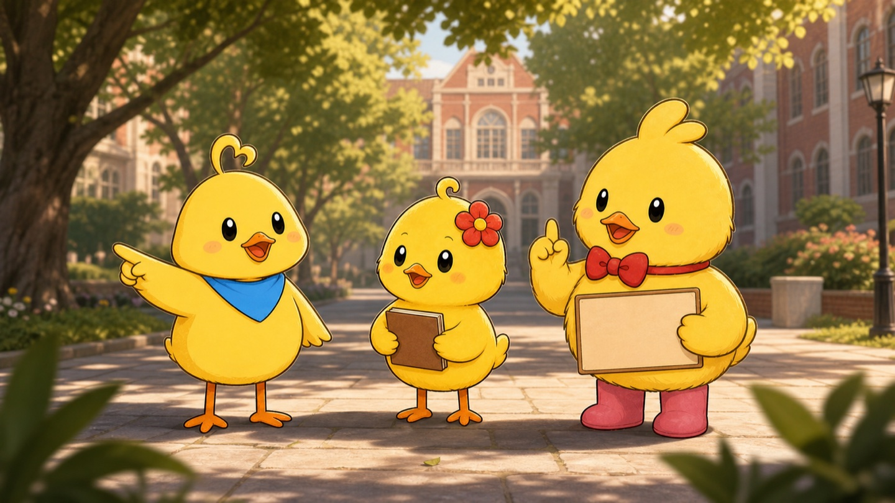

1. AIGC 到底能完成哪些内容任务
2. 为什么现在值得学习 AI 视频
3. 鸭鸭项目为什么选择 IP 视频
4. 国内外有哪些值得认识的模型
5. 一条 AI 视频怎样从选题走到发布
6. 12 名同学怎样进入第一次共创

## AIGC

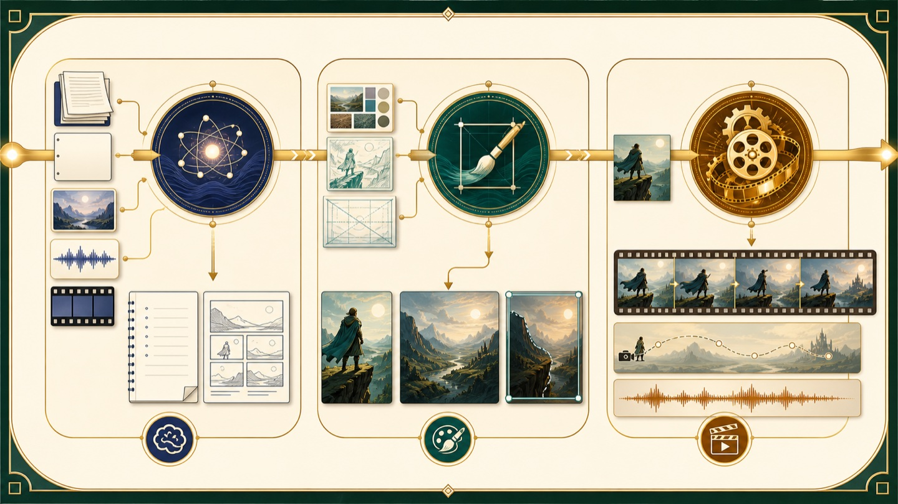

AIGC 可以理解为用人工智能生成或修改内容。输入可以是文字、图片、声音和视频，输出也可以跨越这些媒介。

| 我们交给 AI 的内容 | AI 可以协助完成的事情 |
|---|---|
| 一个想法或问题 | 调研、讨论方向、补充问题 |
| 一段资料或脚本 | 摘要、改写、分镜、提示词 |
| 一张角色图或草图 | 生成新画面、改构图、统一风格 |
| 一段动作或声音 | 生成表演、镜头运动和音画内容 |

## AI生成式内容

| 内容类型 | 常见成果 | 在视频项目里的位置 |
|---|---|---|
| 文字 | 选题、脚本、标题、发布文案 | 决定作品讲什么 |
| 图片 | 角色图、场景图、海报、分镜 | 固定人物、空间和构图 |
| 视频 | 动作、表演、运镜、转场 | 形成逐镜头素材 |
| 声音 | 配音、音效、音乐 | 建立情绪与节奏 |
| 多模态理解 | 看图、看片、听音频、读文件 | 检查问题并提出修改方向 |

## AI视频

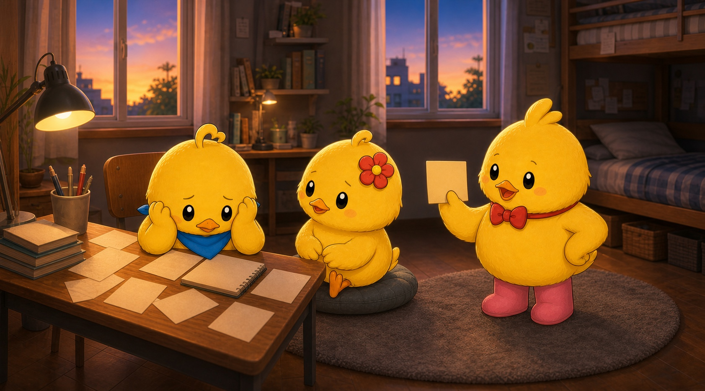

视频把文字、画面、声音和动作组织在一起，也让心理知识进入具体的校园情境。

- 信息更完整。脚本、画面、对白和动作进入同一个作品
- 心理内容更具体。焦虑、拖延和人际关系，可以放进宿舍、课堂与考试等校园情境
- 传播更方便。一条成片可以用于短视频账号、校园活动和课堂分享

## 前一步越清晰，后一步返工越少

**想法 → 选题 → 脚本 → 分镜 → 关键帧 → 视频生成 → 剪辑 → 发布 → 复盘**

- AI 可以进入每一个环节
- 人决定作品的方向、取舍和完成标准
- 前一步越清楚，后一步的返工越少

# AI发展大背景介绍

| 阶段 | 典型能力 | 创作者能做什么 |
|---|---|---|
| 对话与文字 | 读资料、写作、推理 | 调研选题，形成脚本 |
| 图片生成与编辑 | 参考图、局部修改、一致性 | 固定角色、场景和分镜 |
| 视频生成与编辑 | 动作、运镜、声音、多种参考 | 把关键帧变成镜头 |
| 多模态协作 | 同时理解文字、图片、音频和视频 | 让不同素材进入同一条工作流 |

模型会持续更新，选题、脚本、镜头、角色和剪辑仍然是作品成立的基础。

## 为什么用

| 过去容易卡住的地方 | 现在可以先做的尝试 | 会逐渐形成的能力 |
|---|---|---|
| 不会画角色 | 先生成一张角色关键帧 | 角色设计与画面判断 |
| 没有演员和场地 | 先完成一个五秒动作 | 镜头设计与动作控制 |
| 一个人做不了完整动画 | 把流程拆成多个短任务 | 项目协作与导演判断 |
| 想法很难快速验证 | 当天做出第一版可见结果 | 快速试错与问题定位 |

## AIGC设计师（全职兼职）

| 公开岗位样本 | 页面标注 | 岗位明确要求的能力 |
|---|---|---|
| AI 编导实习 | 5000 至 8000 元每月 | 创意、脚本分镜、提示词、画面控制、IP 运营 |
| AIGC 视频设计师 | 10000 至 15000 元每月 | 图视频生成、剪辑、审美、创意、团队配合 |
| AIGC 视频评估实习 | 300 元每天加绩效 | 镜头语言、节奏、转场、叙事判断、文字表达 |

这些数字来自公开岗位样本，具体薪资会受到城市、经验和作品质量影响。

## 怎么用

| 能力 | 能解决的问题 |
|---|---|
| 选题与脚本 | 内容有没有明确对象和故事 |
| 分镜与提示 | 每个镜头能不能被执行 |
| 图片与视频生成 | 角色、空间、动作能不能保持稳定 |
| 剪辑与声音 | 片段能不能成为完整作品 |
| 修改与交付 | 反馈来了以后能不能准确改动 |

会点生成按钮可以完成第一次尝试。稳定交付作品需要整条能力链。

## 项目参与

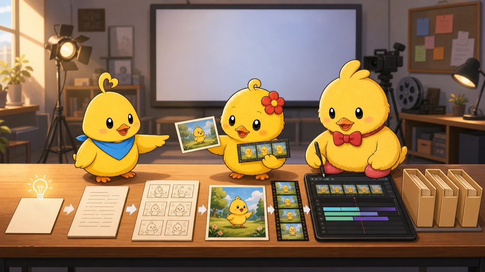

| 你会得到 | 可以用来做什么 |
|---|---|
| 免费课程 Token | 对话、生图、生视频 |
| 一套真实项目资料 | 看见脚本、分镜、关键帧、源片和成片怎样对应 |
| 三只固定鸭鸭 IP | 练习角色一致性、故事和视频制作 |
| 小组共创机会 | 从自己擅长的位置进入完整项目 |
| 可继续修改的作品 | 用于作品集、账号内容或后续项目 |

## 个人介绍

| 经历 | 与这门课的关系 |
|---|---|
| 四川农业大学设计专业本硕 | 熟悉校园环境与学生创作过程 |
| 美国生成式图片平台相关 RA 经历 | 参与过生成式图片产品搭建 |
| NeoVista 生成平台创业 | 持续把模型接入真实创作流程 |
| 一年考研辅导经历 | 关注学生能不能听懂并真正开始操作 |

# 鸭鸭视频背景介绍

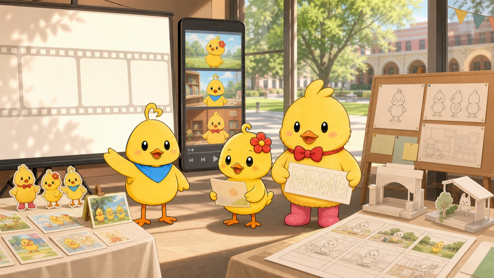

单条视频解决一次传播，IP 视频让同一组角色持续承接内容。角色的外形、性格和关系稳定以后，观众再次看到它们时，可以直接进入新的故事。

| 单条视频 | IP 视频 |
|---|---|
| 每次重新介绍人物与背景 | 角色一出现，观众已经知道它是谁 |
| 内容之间联系较弱 | 不同主题可以积累成连续记忆 |
| 传播结束后素材容易闲置 | 角色可以进入活动、文创和后续合作 |
| 一次项目对应一次交付 | 每一期都能继续完善角色与制作资料 |

## 为什么要打造IP

| 已经发生的事情 | 为后续项目留下的基础 |
|---|---|
| 2025 年鸭鸭心理漫画展完成 30 幅原创作品 | 鸭鸭已经和校园心理内容建立联系 |
| 2026 年 5·25 活动进入雅安、成都和都江堰三个校区 | 角色可以承接跨校区活动与学生参与 |
| 《一觉醒来，下午没了》等视频开始形成 | 漫画角色已经进入动态故事与短视频 |
| 学校持续开展心理健康活动 | 选题拥有真实校园节点和专业内容支持 |

## IP能够承载什么

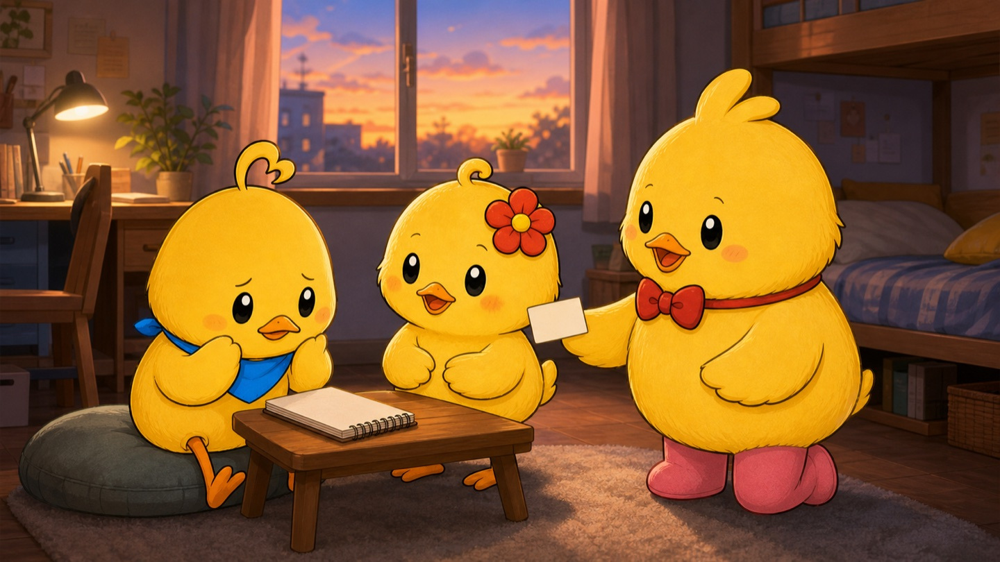

《一觉醒来，下午没了》把问题性完美主义放进一个学生熟悉的傍晚。

| 故事发生了什么 | 观众看见了什么 |
|---|---|
| 饭团在 17 点 48 分醒来 | 一天的计划已经被打乱 |
| 她把一次晚起理解成整天失败 | 拖延、自责和刷手机继续发生 |
| 小小先听见她的感受 | 难开口的话被说出来 |
| 馒头把计划翻回今天 | 角色找到一件还能完成的小事 |

心理内容跟着角色的行动出现，学生先认出生活，再理解知识。

## 对于大家这个IP有什么用


| 场景 | 可以形成的内容 | 对学生和学校的作用 |
|---|---|---|
| 日常心理内容 | 拖延、比较焦虑、宿舍关系、考试压力 | 把知识放进熟悉的生活片段 |
| 校园节点 | 新生季、考试周、毕业季、5·25、10·10 | 一学年形成连续的角色记忆 |
| 线上线下活动 | 预热视频、推文、展板、贴纸、打卡任务 | 线上看见角色，线下继续互动 |
| 学生共创 | 观察、选题、脚本、关键帧、生成、剪辑 | 课堂练习进入真实校园内容 |
| 创新创业比赛 | 调研、作品、用户反馈、团队过程 | 为大创、挑战杯等项目积累证据 |
| 后续合作 | 校园角色联动、文创、品牌活动 | 让稳定角色进入更广的合作场景 |
| 数字产品 | AI 问答、活动查询、知识科普、资源导航 | 从内容扩展到长期使用的服务 |

## IP打造


| 角色 | 固定形象 | 在故事里的工作 | 在《一觉醒来，下午没了》里的行动 |
|---|---|---|---|
| 饭团 | 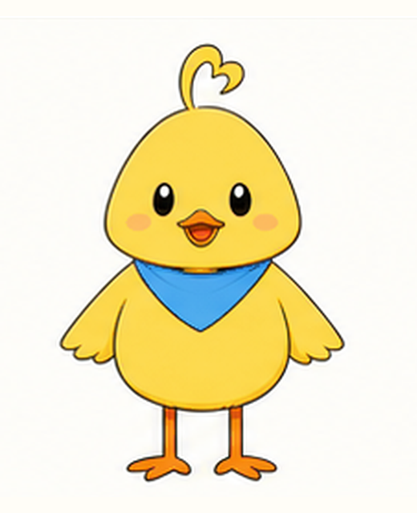 | 进入问题现场，先遇到学生正在经历的麻烦 | 睡到傍晚，开始拖延和自责 |
| 小小 | 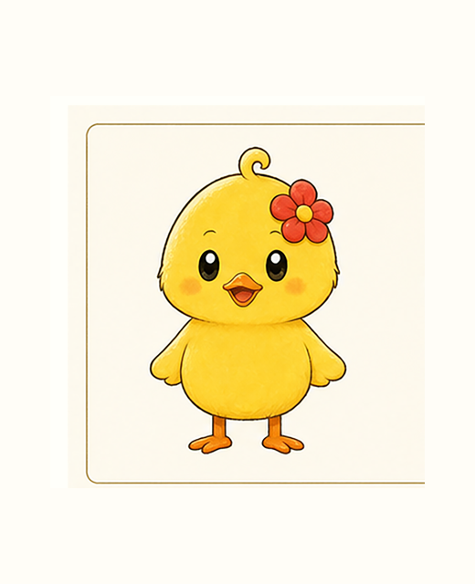 | 听见感受，帮角色说出难开口的话 | 看见饭团把计划打乱理解成整天失败 |
| 馒头 | 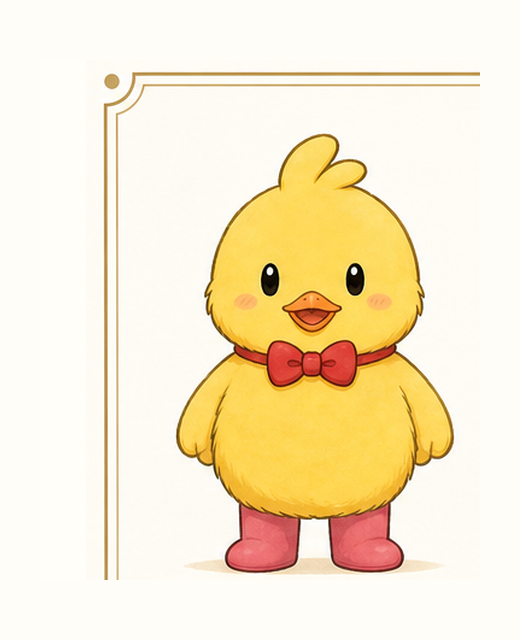 | 把问题拆小，推动一个马上能做的动作 | 翻回今天的计划，带大家先去散步 |

三只角色有稳定分工，也可以轮流成为主角。每个故事都要保留它们原有的性格和关系。

## 如何打造

| 要长期坚持的事情 | 鸭鸭项目里的具体做法 |
|---|---|
| 稳定更新 | 让角色在一学期里反复出现 |
| 观察校园 | 跟着校历、活动和学生正在讨论的问题找选题 |
| 保持角色 | 固定形象、性格、关系和说话方式 |
| 积累资料 | 保存角色板、场景板、提示词、镜头和失败原因 |
| 查看反馈 | 把播放、评论和学生反馈带回下一期选题 |

## 发展方向

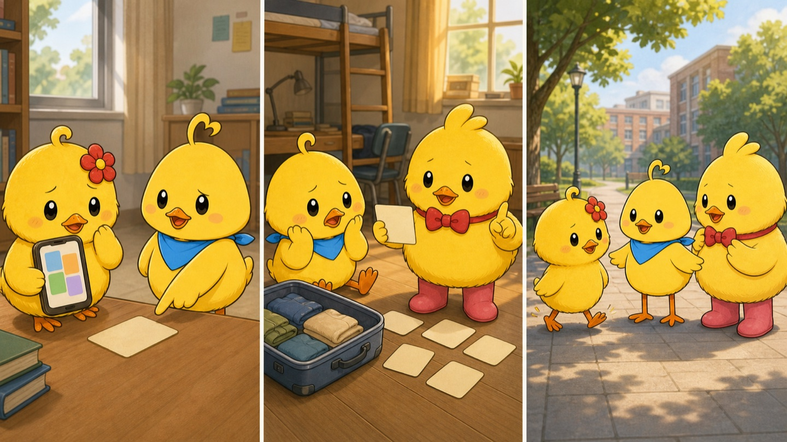

| 方向 | 先完成的事情 | 可以继续发展的成果 |
|---|---|---|
| 心理微剧情 | 用一件具体小事承接一个心理主题 | 稳定的角色、故事和制作流程 |
| 校园热点回应 | 围绕开学、考试、毕业和校园活动快速制作 | 更及时的校园内容栏目 |
| 学生团队发展 | 持续留下作品、调研和发布数据 | 大创、创新创业比赛、作品集和小型工作室 |

# 你们能够获得什么


这次共创会让每位同学进入一条真实制作链。成果可以来自完整成片，也可以来自脚本、分镜、角色管理、失败判断、剪辑或发布复盘。

| 可以带走的成果 | 具体内容 |
|---|---|
| 工具能力 | 对话、生图、生视频和多模态理解 |
| 项目能力 | 选题、协作、修改、交付和资料整理 |
| 可展示作品 | 脚本、分镜、关键帧、镜头和成片 |
| 个人方向 | AIGC 岗位、自媒体、竞赛或继续深造的实践材料 |

## AIGC设计师（全职兼职）

| 可以进入的位置 | 第一次可以完成的小任务 | 继续做下去以后 |
|---|---|---|
| 校园观察与选题 | 记下一句学生最近反复说的话 | 整理成可以讨论的选题卡 |
| 脚本与分镜 | 把一段对白改成可看见的动作 | 独立完成故事与镜头设计 |
| 角色与关键帧 | 对照角色板挑出走样图片 | 维护角色、场景和提示词资料 |
| 视频生成 | 用批准的关键帧完成一个动作 | 拆动作、选模型、比较版本 |
| 剪辑与声音 | 把三个短镜头接顺 | 完成字幕、音效、节奏和成片 |
| 发布与复盘 | 整理标题、封面和评论 | 用数据和反馈改进下一期 |

## 分组


第一轮采用 3 组，每组 4 人。位置根据问卷里的项目经验、影视经历和 AI 使用情况安排，后续可以调整。

| 小组 | 人数 | 第一轮的能力组合 |
|---|---|---|
| A 组 | 4 人 | 项目统筹与发布、分镜与视频、拍摄剪辑、图片生成 |
| B 组 | 4 人 | 视频统筹、画面检查与发布、脚本剪辑、视觉成员 |
| C 组 | 4 人 | 脚本统筹、图片与视频、画面检查与资料整理、综合成员 |

每组都需要有人推进、有人制作，也需要有人负责检查结果。

## token激励


| 使用方式 | 需要留下的内容 |
|---|---|
| 对话与调研 | 问题、材料和修改后的选题 |
| 图片生成 | 提示词、参考图、批准版本和失败版本 |
| 视频生成 | 关键帧、动作要求、源片和版本判断 |
| 结果修改 | 具体问题、修改方法和新结果 |

每一次生成都要知道自己在测试什么。连续点击同一个按钮，很容易得到一组相似的问题。

# AI工具介绍（泛化介绍）


做内容时，常用模型可以先分成三类。模型名称会更新，任务类型相对稳定。

| 模型类型 | 主要处理的内容 | 常见成果 |
|---|---|---|
| 大语言与理解模型 | 文字、资料、图片、音频、视频 | 调研、脚本、分镜、提示词、分析意见 |
| 图片生成与编辑模型 | 角色、场景、构图、风格、静态文字 | 角色图、海报、分镜、首帧、尾帧 |
| 视频生成与编辑模型 | 动作、表演、运镜、声音、已有视频 | 文生视频、图生视频、首尾帧视频、视频编辑 |

## 工具功能介绍

| 大家打开的产品或平台 | 平台里工作的模型 |
|---|---|
| ChatGPT | GPT-5.6 Sol、Terra、Luna |
| Kimi | K3、K2.6、K2.7 Code |
| 可灵 | 图片 3.0、视频 3.0、3.0 Omni |
| 海螺 | MiniMax H3 |
| Gemini | Gemini 3.6 Flash、Nano Banana、Veo 等模型 |

同一个产品会更新模型，也可能同时提供多个能力档位。

## 国内

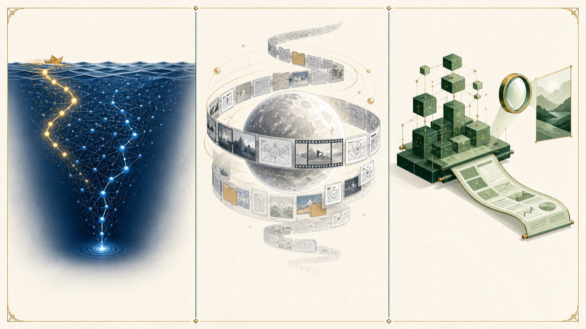

| 当前模型 | 需要记住的特点 | 更适合先做的任务 |
|---|---|---|
| DeepSeek V4-Flash | 100 万上下文，速度快，成本低 | 批量想法、摘要、格式整理、第一版脚本 |
| DeepSeek V4-Pro | 100 万上下文，复杂推理更强 | 困难问题、长方案、最终复核 |
| Kimi K3 | 100 万上下文，面向知识工作 | 多文件项目、长报告、深度研究 |
| Kimi K2.6 | 支持文字、图片和视频输入 | 看图、看片、常规对话、快速分析 |
| GLM-5.2 | 100 万上下文，最大输出 12.8 万 | 长脚本、表格、文件整理 |
| GLM-5V-Turbo | 视觉理解与推理 | 图片检查、界面分析、视觉问题定位 |

## 大语言模型

| 眼前任务 | 第一轮选择 | 选择依据 |
|---|---|---|
| 快速生成大量中文想法 | DeepSeek V4-Flash | 快速、低成本，适合初筛 |
| 复杂推理与困难方案 | DeepSeek V4-Pro | 更适合多步推理与复核 |
| 一次带入大量项目文件 | Kimi K3 或 GLM-5.2 | 长上下文适合持续带资料工作 |
| 直接分析图片或视频 | Kimi K2.6 或 GLM-5V-Turbo | 可以接收并理解视觉输入 |
| 长文字与结构化结果 | GLM-5.2 | 适合表格、长输出和文件整理 |

事实、数据和心理健康表达都需要人工核对。

## sd

| 模型 | 类型 | 核心能力 | 在视频流程里的位置 |
|---|---|---|---|
| Seedream 5.0 Pro | 图片生成与编辑 | 复杂构图、较多文字、专业分镜、标注修改 | 固定角色、场景、构图和关键帧 |
| Seedance 2.5 | 音视频联合生成 | 最长 30 秒、多种参考、运镜、角色调度、视频编辑 | 让关键帧产生动作、表演和镜头运动 |

本课程提到的 SD 指 Seedance。Seedream 和 Seedance 分别负责图片与视频。

## 图视频模型

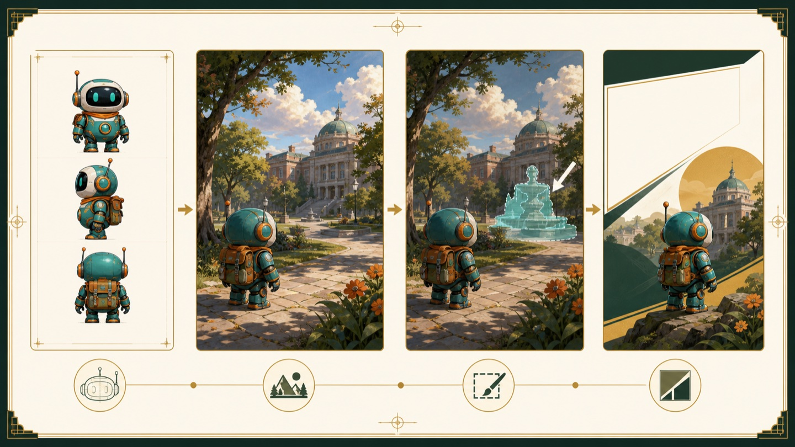

| 图片模型 | 主要优势 | 更适合的任务 |
|---|---|---|
| Seedream 5.0 Pro | 专业分镜、复杂画面、定向编辑 | 角色板、场景板、信息密集关键帧 |
| 可灵图片 3.0 与 Omni | 2K、4K 输出，与可灵视频衔接顺 | 后续准备进入可灵视频的项目 |
| GLM-Image | 中文文字渲染与知识密集画面 | 中文海报、知识卡、文字较多的画面 |

第一次测试可以用同一份角色、场景和构图要求比较三个模型。

## 图视频模型国内

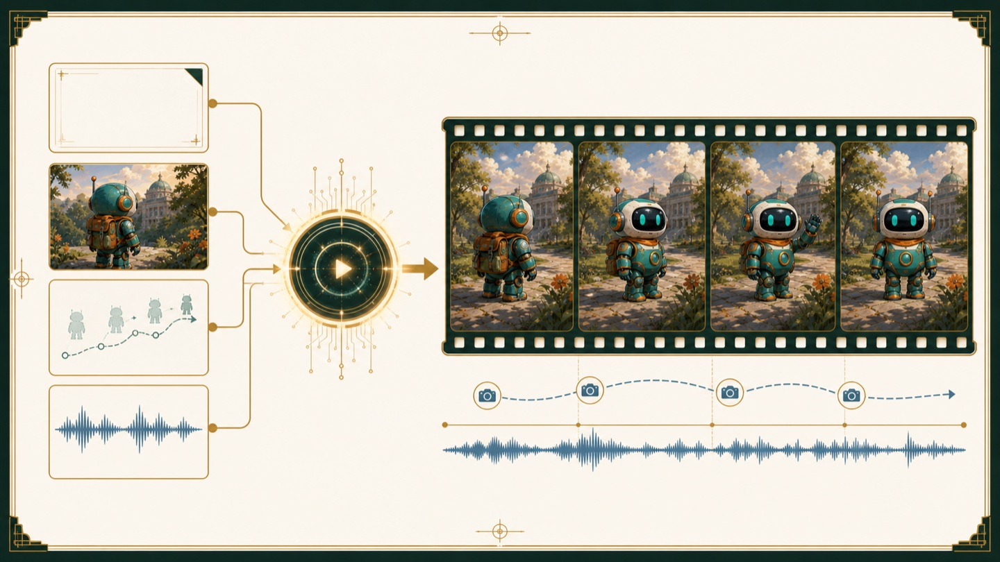

| 视频模型 | 主要能力 | 优先尝试的任务 |
|---|---|---|
| Seedance 2.5 | 最长 30 秒，多种参考，运镜和已有视频修改 | 较长叙事、多参考镜头、视频编辑 |
| 可灵 3.0 与 Omni | 最长 15 秒，多人物、多镜头、原生声音 | 多角色、连续身份、对白 |
| MiniMax H3 | 最高 2K，最长 15 秒，原生立体声 | 动作迁移、音画共同输入、较大表演 |
| CogVideoX-3 | 文生视频、图生视频、首尾帧控制 | 起点与终点清楚的短动作 |

镜头只有一个动作时，五秒通常比三十秒更容易控制。

## oai

| 模型 | 位置 | 适合的任务 |
|---|---|---|
| GPT-5.6 Sol | 旗舰档 | 最难的专业工作、复杂推理、工具协作 |
| GPT-5.6 Terra | 平衡档 | 日常创作、调研、脚本、多轮修改 |
| GPT-5.6 Luna | 高频低成本档 | 批量任务、快速处理、成本敏感场景 |

三个版本都支持文字与图片输入、视觉理解和长上下文。ChatGPT 是产品，GPT-5.6 是其中的模型系列。

## Anthropic

| 模型 | 位置 | 适合的任务 |
|---|---|---|
| Claude Fable 5 | 公开主线最高能力档 | 高难度分析与复杂知识工作 |
| Claude Opus 5 | 复杂工作档 | 长任务、严谨写作、复杂修改 |
| Claude Sonnet 5 | 能力与速度平衡档 | 长脚本、多轮修改、日常主力 |
| Claude Haiku 4.5 | 快速低成本档 | 简单分析、批量任务、快速回复 |

Claude 可以理解文字和图片，输出以文字为主。图片与视频生成需要连接其他模型。

## google

| 模型 | 位置 | 适合的任务 |
|---|---|---|
| Gemini 3.6 Flash | 稳定日常主力 | 文字、图片、视频、音频和 PDF 理解 |
| Gemini 3.1 Pro Preview | 复杂能力预览档 | 高难度问题与复杂多模态任务 |
| Gemini 3.5 Flash-Lite | 高速低成本档 | 大量轻任务与快速处理 |

Gemini 可以直接理解视频和音频。Google 的图片与视频生成模型也能进入同一套多模态工作流。

## 国外

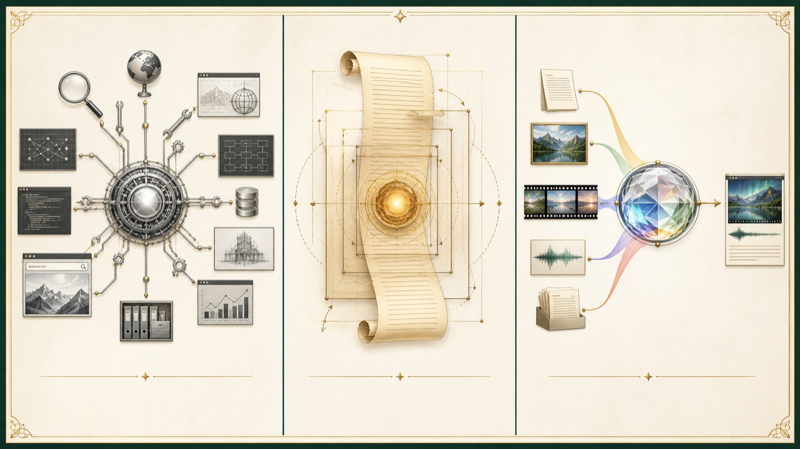

| 公司 | 日常主力位置 | 更适合先做的事情 |
|---|---|---|
| OpenAI | GPT-5.6 Terra | 综合任务、工具协作、文字与图片理解 |
| Anthropic | Claude Sonnet 5 | 长内容、连续修改、脚本与图片分析 |
| Google | Gemini 3.6 Flash | 同时理解文字、图片、视频、音频和 PDF |

复杂任务可以升级到各家的旗舰档，高频简单任务可以使用更快、更低成本的档位。

## 对应上述三家 图视频模型


| 公司 | 当前模型 | 主要能力 |
|---|---|---|
| OpenAI | GPT Image 2 | 高质量图片、参考图保持、局部与整体编辑 |
| Google | Nano Banana 2 Lite | 批量草图与快速试风格 |
| Google | Nano Banana 2 | 4K、文字、多参考、一致性与通用编辑 |
| Google | Nano Banana Pro | 复杂视觉、品牌一致性与精确控制 |
| Google | Gemini Omni Flash | 多种输入、快速视频生成、多轮对话修改 |
| Google | Veo 3.1 | 原生音频、视频延长、尾帧控制与图片引导 |

Anthropic 当前没有第一方图片与视频生成模型。Sora 2 与 Sora 2 Pro 已经进入弃用状态，不作为本次上机主力。

## 对比差异，如何使用

| 顺序 | 模型 | 更适合的任务 |
|---|---|---|
| 1 | Nano Banana 2 | 通用图片、多参考、一致性、文字和编辑 |
| 2 | Seedream 5.0 Pro | 专业分镜、复杂画面、带标注的定向修改 |
| 3 | GPT Image 2 | 高质量图片、参考图保持、局部编辑 |
| 4 | Nano Banana Pro | 正式海报、品牌一致性、复杂版式 |
| 5 | 可灵图片 3.0 或 GLM-Image | 接入可灵视频，或制作中文知识画面 |

这个顺序面向第一次课堂尝试。正式项目要用同一份要求做小范围测试。

## 图视频模型国内

| 顺序 | 模型 | 更适合的任务 |
|---|---|---|
| 1 | Seedance 2.5 | 较长内容、多种参考、运镜和视频编辑 |
| 2 | 可灵 3.0 Omni | 多角色、连续身份、对白和多模态参考 |
| 3 | MiniMax H3 | 动作参考、原生立体声和 2K 短片 |
| 4 | Gemini Omni Flash | 快速生成和多轮对话修改 |
| 5 | Veo 3.1 | 视频延长、尾帧控制和电影化镜头 |

时长、参考材料、角色数量和声音要求会直接改变选择顺序。

## 对比差异，如何使用

| 眼前任务 | 第一轮优先尝试 | 选择依据 |
|---|---|---|
| 快速生成一批中文想法 | DeepSeek V4-Flash 或 Kimi K2.6 | 访问方便，速度适合初筛 |
| 一次读取很多项目文件 | Kimi K3、GLM-5.2 或 GPT-5.6 Terra | 长上下文适合持续带资料工作 |
| 直接分析一段视频 | Gemini 3.6 Flash 或 Kimi K2.6 | 可以直接接收视频输入 |
| 连续修改长脚本 | Claude Sonnet 5 或 GPT-5.6 Terra | 长内容与多轮修改稳定 |
| 快速生成图片草图 | Nano Banana 2 Lite | 速度与成本适合大量试验 |
| 正式生成复杂图片 | Nano Banana 2、Seedream 5.0 Pro 或 GPT Image 2 | 多参考、复杂指令和编辑各有优势 |
| 生成较长或多参考视频 | Seedance 2.5 | 单次时长与参考控制突出 |
| 生成多角色与对白视频 | 可灵 3.0 Omni | 连续身份、多人物和音画能力明确 |

## 怎么用

| 要交代的内容 | 写清什么 |
|---|---|
| 任务 | 这一轮只让 AI 完成哪一件事 |
| 材料 | 已经核验的资料、角色图、场景图或参考视频 |
| 结果 | 要脚本、表格、分镜、提示词还是修改意见 |
| 边界 | 受众、时长、画幅、角色规则和不能出现的内容 |

第一版出来以后，指出一个具体问题再修改。角色走样、动作过多和镜头不清楚都比“再高级一点”更容易执行。

## 工具功能介绍

```text
我要为大学生做一条 60 秒短视频。

受众
没有专业背景的大学生。

主题材料
把已经核验的资料放在这里。

表达要求
用真实生活场景开头。
不虚构数据，不替观众做心理诊断。

本轮任务
先提出 5 个会影响选题成立的问题。
等我回答以后，再给 3 个不同的故事方向。
每个方向写清开头发生什么，中间冲突在哪里，结尾人物做了什么。
```

先确认选题，再写完整脚本，可以减少后续大段删除与重写。

# AI视频工作流介绍


**选题 → 脚本 → 分镜 → 分镜提示词 → 图片与关键帧 → 分镜视频 → 剪辑 → 发布准备 → 资料整理 → 数据复盘**

每一步只解决一个明确问题。角色、空间和动作越早固定，后面的生成越可控。

## 如何制作一个可控AI视频

| 环节 | 需要回答的问题 | 应该留下的成果 |
|---|---|---|
| 选题 | 这条片给谁看，为什么值得做 | 选题卡、受众和内容目标 |
| 脚本 | 角色经历了什么，最后做了什么 | 完整故事、对白与可见动作 |
| 分镜 | 观众每几秒看见什么 | 镜头编号、景别、动作、声音、时长 |
| 分镜提示词 | 模型怎样执行这个镜头 | 图片提示、视频提示和参考材料 |

## 分镜提示词控制


| 要固定的内容 | 检查问题 |
|---|---|
| 角色 | 外形、服装、比例和表情是否符合角色板 |
| 场景 | 床、桌子、门窗和道具的位置是否连续 |
| 构图 | 景别、机位、视线和主体是否清楚 |
| 文字 | 画面里的时间、标题和知识卡是否准确 |
| 首尾状态 | 动作从哪里开始，到哪里结束 |

关键帧通过以后再进入视频生成，可以减少角色漂移和空间错误。

## 分镜视频生成


| 镜头要求 | 需要写清的内容 |
|---|---|
| 主体动作 | 谁先动，动作按照什么顺序发生 |
| 镜头运动 | 固定、推近、拉远、跟随或环绕 |
| 表演状态 | 速度、力度、视线、表情和停顿 |
| 环境变化 | 风、光线、物体和背景怎样变化 |
| 声音 | 对白、环境声、音效和节奏 |

一个镜头塞入太多动作时，先拆成两个更短的镜头。

## 整体调整和剪辑

| 剪辑要处理的内容 | 完成标准 |
|---|---|
| 镜头顺序 | 故事关系清楚，没有跳跃 |
| 节奏 | 动作、停顿和信息出现的时机合适 |
| 声音 | 对白清楚，音乐和音效不抢内容 |
| 字幕与知识卡 | 文字准确，屏幕停留时间足够 |
| 画面统一 | 色彩、角色比例和包装保持一致 |
| 发布版本 | 横版、竖版、封面和平台文案准备完整 |

发布以后还要整理源文件，并记录 3 天、7 天和 14 天的数据变化。

## 完整走完一次流程，选题讨论择优


| 环节 | 《一觉醒来，下午没了》留下的材料 |
|---|---|
| 选题 | 17 点 48 分醒来，把计划打乱理解成整天失败 |
| 脚本 | 8 段故事与可见动作 |
| 分镜 | 19 个镜头的编号、时长、景别、动作和声音 |
| 角色与场景 | 3 张固定角色板、场景板和道具规则 |
| 图片 | 43 张唯一静态图 |
| 视频 | 按镜头保存的 Seedance 源片和提示词 |
| 失败记录 | SH05、SH09、SH12 等失败版本与原因 |
| 成片 | 84.02 秒视频、字幕、时间 UI、知识卡和音效 |
| 发布 | 封面、三平台文案、源片和资料清单 |

## 和传统视频流程对比

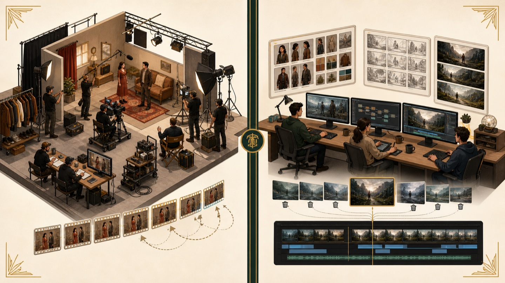

| 环节 | 传统拍摄或动画 | AI 视频 |
|---|---|---|
| 前期 | 找演员、场地、美术或动画团队 | 准备角色板、场景板、脚本和参考材料 |
| 画面 | 现场拍摄、补拍或逐帧制作 | 图片模型定关键帧，视频模型生成片段 |
| 修改 | 补拍或重新制作一段动画 | 改参考图、提示词、镜头拆法或模型 |
| 成本 | 设备、人员、场地和制作时间 | Token、订阅、失败生成、筛选和后期时间 |
| 小团队 | 每个人负责少数专业环节 | 一个人可以兼顾更多步骤 |

AI 减少了一部分拍摄与逐帧制作，返工、筛选和导演判断会占据新的时间。

## 每个流程对应的工具

| 流程 | 主要工具 | 得到的内容 |
|---|---|---|
| 选题、调研与脚本 | 大语言模型与搜索 | 选题卡、事实资料、完整脚本 |
| 分镜与提示词 | 大语言模型加人工导演判断 | 分镜表、图片提示、视频提示 |
| 角色、场景与关键帧 | 图片生成与编辑模型 | 角色板、场景板、首帧、尾帧 |
| 分镜视频 | Seedance、可灵、H3、Omni Flash、Veo | 逐镜头源片 |
| 画面检查 | 人工审看加多模态理解模型 | 通过、修改或重做的判断 |
| 剪辑包装 | 剪映、Premiere、After Effects 等 | 成片、字幕、声音、标题、知识卡 |
| 发布与复盘 | 平台后台、表格和语言模型 | 发布版本、文件索引、数据观察 |

## 基于AI视频工作流内的具体AI工具的使用流程解析

| 看到的问题 | 先检查的位置 | 常见修改 |
|---|---|---|
| 角色变脸或服装变化 | 角色板与参考图 | 减少冲突参考，换成批准角色图 |
| 房间结构不断变化 | 场景板与机位 | 固定空间关系，减少一次生成的变化 |
| 动作混乱或肢体错误 | 动作数量与顺序 | 拆短镜头，只保留一个主要动作 |
| 镜头没有重点 | 分镜与构图 | 明确主体、景别和镜头运动 |
| 节奏拖沓 | 镜头时长与剪辑 | 缩短动作，调整停顿与镜头顺序 |
| 信息说不清 | 选题与脚本 | 回到受众、冲突和角色行动 |

# 热门作品解析

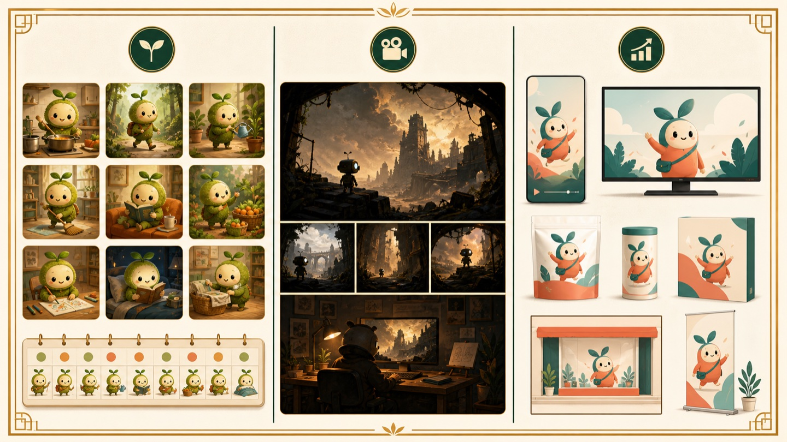

| 案例 | 最值得看的能力 |
|---|---|
| 小蘑菇秃秃 | 用稳定角色和小故事持续运营账号 |
| Mx-Shell《丧尸清道夫》 | 用个人审美和完整世界撑住长片 |
| 小蘑菇秃秃与 M Stand | 让角色、品牌和线下物料同时成立 |

三个案例使用的工具会变化，内容尺度、个人选择和交付标准仍然决定作品质量。

## 蘑菇IP-账号制作

2026 年 5 月 7 日的“煮面条”视频只讲一件事。秃秃以为自己放了一点面，锅里的面却越来越多。

| 公开页面数据 | 观察到的内容特点 |
|---|---|
| 12.6 万点赞 | 角色外形与微缩世界稳定 |
| 2 万评论 | 观众继续用角色语言参与故事 |
| 4.4 万分享 | 一件生活小事也能形成传播 |

鸭鸭可以学习稳定更新与故事尺度，内容要来自川农学生自己的生活。

## mxshell 丧尸清道夫-极端个人表达

| 制作信息 | 作品表现 |
|---|---|
| 片长约 3 分 34 秒 | 观众需要跟随一个完整世界 |
| 制作约 10 天 | 创作者持续处理角色、场景和镜头 |
| 成本约 3000 元 | Token 与生成次数需要被控制 |
| 使用 Seedance 2.0 等工具 | 工具服务于末日类型、黑色幽默和镜头调度 |

模型能执行具体要求。地面积水、机器人站位、沙尘方向和镜头顺序会形成创作者自己的审美。

## 成熟商业动画

小蘑菇秃秃与 M Stand 的联名包含限定杯贴、“一日一菇”盲盒、扫码场景故事和 NFC 数字内容。

| 角色需要保持 | 品牌需要被看见 |
|---|---|
| 外形、性格和原有说话方式 | 产品、颜色、文字和使用方法 |
| 角色仍然在过自己的生活 | 咖啡、通勤和门店场景自然进入故事 |
| 观众继续喜欢这个角色 | 横版、竖版、门店屏和社交平台都能使用 |

未来鸭鸭进入校园活动、文创或联名时，合作内容要符合三只鸭原有的故事方式。

## 甲方项目单

| 客户会问的问题 | 制作方要拿出的东西 |
|---|---|
| 这条片给谁看，要解决什么 | 项目说明、受众和内容目标 |
| 角色和风格会不会变化 | 角色板、场景板和批准的风格稿 |
| 正式制作以前看什么 | 脚本、分镜和关键帧确认稿 |
| 反馈以后怎样修改 | 镜头编号、源片、提示词和版本记录 |
| 最后会交付什么 | 成片、横竖版本、字幕、封面和发布文案 |
| 后续能不能继续使用 | 授权说明、角色素材和整理好的项目文件 |

## 项目参与

EP04 可以拿出完整脚本、19 镜头分镜、43 张静态图、Seedance 提示词、正式源片、失败记录、84.02 秒成片、封面和三平台发布文案。

| 单个文件能说明什么 | 整套资料能说明什么 |
|---|---|
| 一张图说明画面做出来了 | 角色与场景能保持连续 |
| 一段源片说明模型生成成功 | 团队知道怎样拆镜头与判断版本 |
| 一条成片说明剪辑完成 | 项目可以从需求走到发布 |
| 一次数据说明有人看过 | 后续选题可以继续根据反馈调整 |

# 作业：基于鸭鸭视频三个选题


| 候选选题 | 学生正在经历的场景 | 鸭鸭故事可以落在哪里 |
|---|---|---|
| 刷到别人都在进步，我是不是落后了 | 看见同学实习、竞赛和考研打卡，自己开始发慌 | 小小看到的只是别人生活的一小段，饭团陪她回到今天能做的一步 |
| 开学前还没准备好 | 行李没收完，计划也没完成，担心新学期马上跟不上 | 饭团越列清单越慌，馒头帮她挑出今晚真要完成的事情 |
| 我不敢主动认识新朋友 | 想开口，又担心尴尬或被拒绝 | 小小试一句低压力的开场，饭团陪她经历短暂冷场 |

## 做到你的认为可以的程度

1. 每组选择一个候选选题
2. 写清受众正在经历的具体场景
3. 决定由哪只鸭鸭进入问题现场
4. 让故事最后出现一个可以看见的行动
5. 选择脚本、分镜、关键帧或短视频中的一个成果继续完成
6. 保留提示词、参考图、结果和修改记录

## 发挥你对工具的掌握能力

| 必须留下 | 可以继续挑战 |
|---|---|
| 一句话选题 | 完整脚本 |
| 目标学生与真实场景 | 分镜表 |
| 三只鸭的角色分工 | 批准关键帧 |
| 小组成员的第一轮任务 | 一个短视频镜头 |
| AI 第一版与人工修改 | 剪辑后的段落 |

完成到哪一步都要能说明做了什么、哪里卡住、下一步准备怎样改。

## IP能够承载什么


| 可以做 | 需要避免 | 交给专业老师 |
|---|---|---|
| 描述校园生活里的具体困扰 | 给学生贴心理诊断标签 | 伤害风险与危机干预 |
| 提供轻量知识与可尝试的小动作 | 把一次情绪写成确定疾病 | 具体个案与隐私信息 |
| 展示理解、陪伴与现实行动 | 用一句话保证问题会解决 | 需要持续专业支持的情况 |

鸭鸭帮助学生看见困扰、理解感受并找到下一步行动。它不替代专业咨询。

## 工具功能介绍


1. 参考图之间有没有角色、服装或场景冲突
2. 一个镜头里有没有放入太多连续动作
3. 首帧有没有把角色、空间和构图固定清楚
4. 修改意见有没有指向一个具体问题

增加形容词很少能解决结构问题。拆小任务、换关键帧或回到分镜通常更有效。

## 大家如何参与其中，如何完成制作

| 你现在比较擅长的事情 | 可以先进入的位置 |
|---|---|
| 观察生活与表达问题 | 校园观察、选题、采访 |
| 写作与整理资料 | 脚本、分镜、提示词 |
| 对画面比较敏感 | 图片筛选、角色检查、关键帧 |
| 喜欢动手试工具 | 视频生成、版本比较 |
| 有剪辑与音乐经验 | 剪辑、字幕、声音 |
| 擅长组织与复盘 | 项目推进、发布、数据整理 |

能准确说出一个版本哪里有问题，已经在参与制作。

## 为什么用

| 会越来越快的环节 | 仍然需要人的判断 |
|---|---|
| 生成草图、改写和批量试验 | 选题与受众是否成立 |
| 按要求生成短镜头 | 角色与故事是否值得留下 |
| 处理重复格式和多个版本 | 哪个版本能进入成片 |
| 辅助剪辑、字幕和资料整理 | 反馈以后怎样修改与交付 |

公开岗位已经把 AI 工具写进要求，同时继续要求分镜、剪辑、审美和作品集。

# 项目参与


**选题与脚本｜角色与关键帧｜视频生成｜剪辑与声音｜发布与复盘**

第一节课的结果是一张完整地图。下一节课从各组留下的真实版本继续往下做。
